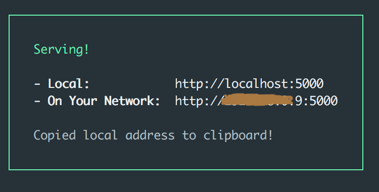
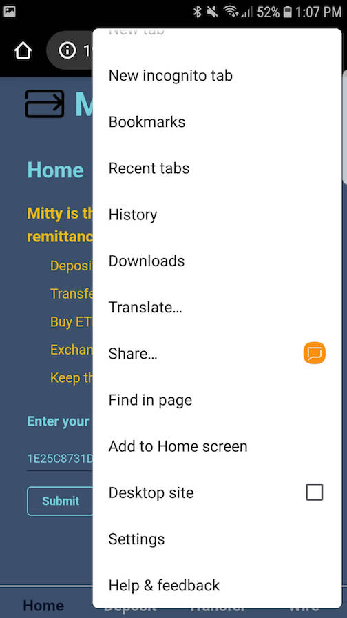

# Mitty 
*The remittance app built on Matic*

Mitty is built on Matic's Layer 2 plasma chain to enable cheap, frictionless Dai transfers anywhere in the world. 

Mitty is a Progressive Web App (PWA), allowing the mobile app to be available *immediately* on iOS and Android, leapfrogging the arduous App Store and Play Store approval processes. 

>Note: On a short hackathon timeline, we only have the equipment to test downloading the PWA on Chrome via Android, but as of iOS 11.3 (pushed March, 2018), PWAs are compatible with all platforms.

## Downloading Mitty

You can download the repo and go through the steps below on your laptop, or navigate to [the deployed site here](https://mitty-app.now.sh/) from your mobile device and skip to [this step](#skip-step) to add to your home screen.

* Clone this repo on a laptop or desktop
* Run ```npm install``` 
* Run ```npm run build```
* Install the npm package ```serve``` running ```npm install -g serve``` 
* Run ```serve -s build```

You should see this view in your terminal



* Take out your mobile device and connect to the same wireless network as your laptop/desktop.
* In your mobile browser, navigate to the IP address on your network

You should see the Mitty home page
<br/>


<div id="skip-step"/>
<br/>
Next, you'll need to add Mitty to your mobile device's home screen, accessible in the Settings menu.

<br/>
<br/>



> Note: On iOS, you'll likely need to press the 'Share' button on your browser to see the 'Add to Home Screen' functionality

<br/>

Give Mitty a name (we would recommend 'Mitty', but the beauty of PWAs is that you can do whatever you want)
<br/>
<br/>


<br/>
Confirm!
<br/>
<br/>


<br/>

And there it is. On your Home screen, just like any other app.

<br/>
<br/>


## Using Mitty

Mitty v1 prioritizes privacy. We don't store any account or user information. In future versions, we may add wallet managers like Portis, Torus or Fortmatic, but right now, you'll need to enter your private key - only stored client-side - to begin using Mitty.

* Enter your private key to access the app (Mitty is only deployed on Ropsten, so we've included a preloaded test account to play around with if you'd like)

Your home page simply displays your mainnet and Matic Dai balances.
> Note: Given that this is a Ropsten deployment of Mitty, the [TTT Matic test token](https://ropsten.etherscan.io/token/0x70459e550254B9D3520a56eE95b78Ee4f2dbd846) is the substitute ERC20, used in place of Dai for testing purposes.

<br/>


<br/>
<br/>

* Click the Deposit tab below and send some Dai from Mainnet (Ropsten) to Matic. It may take a few moments, as this transaction occurs on the main Ethereum network with ~15 second block times.
> Note: You'll need a small amount of ether in your account for the deposit transaction to be successful

> Note: There may be a security warning at this point, but the app should function as expected

<br/>


<br/>

Nice!

You'll also find the Withdraw functionality in this view. It's currently WIP.
Firebase stores ongoing transaction hashes by address to identify whether a withdrawal process is ready to proceed.
<br/>

<!-- <div width="50%"> -->
<!--  -->
<!-- </div> -->


* Next, try transferring some Dai to a friend. You can transfer to any Ethereum address, regardless of whether the recipient has used Matic. The funds will be waiting for them.

* This transaction is nearly instant, demonstrating the value and utility of Matic's L2 technology.

<br/>


<br/>
<br/>

* Finally, we can buy ETH with Moonpay, which deposits the funds directly into our accounts in a matter of minutes.

* You'll have to follow Moonpay's KYC process, conveniently embedded into Mitty with the Moonpay widget.

* Test credit cards are available [here](https://www.moonpay.io/api_reference/v2/) under the 'Test Mode' section

<br/>


<br/>
<br/>

For now, Moonpay's API only distributes ETH on Ropsten, and we're using DAI. To allow users to exchange their newly bought ETH for DAI/TTT, I deployed a [Uniswap exchange on Ropsten](https://ropsten.etherscan.io/address/0xc4659c4dd66d1175d8b3c53b195911ad493bb2eb) for the ETH/TTT pair and added some basic level of liquidity. 

* Try exchanging some ETH for DAI through Mitty and Uniswap. The liquidity is still shallow so 0.5 ETH or less is preferred.

Give the network a couple minutes to confirm your exchange. You should see the updated balance shortly.

<br/>


## To-Do

* Give the option of managing identity in-app with a wallet manager or similar functionality
* Withdrawing funds to a bank account or PayPal (currently not possible on Moonpay, but on the near term roadmap)
* Deploy to Mainnet!
